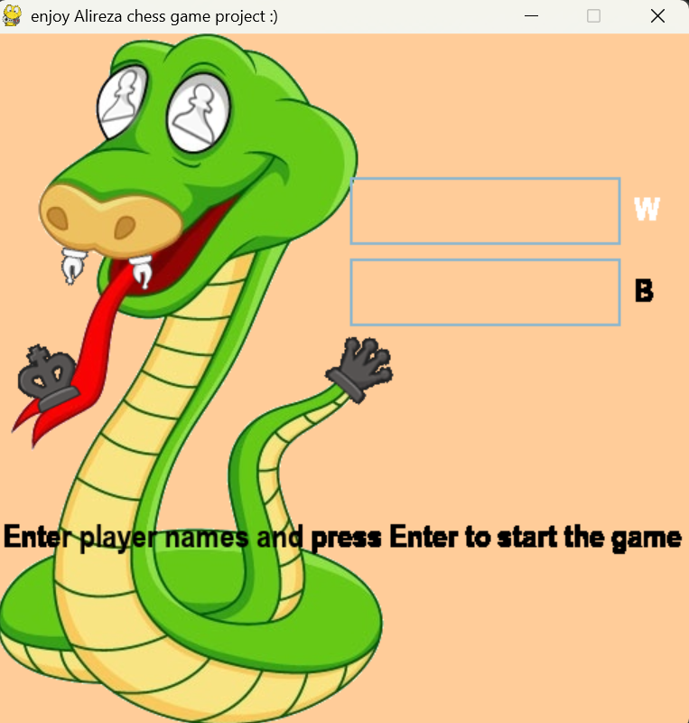
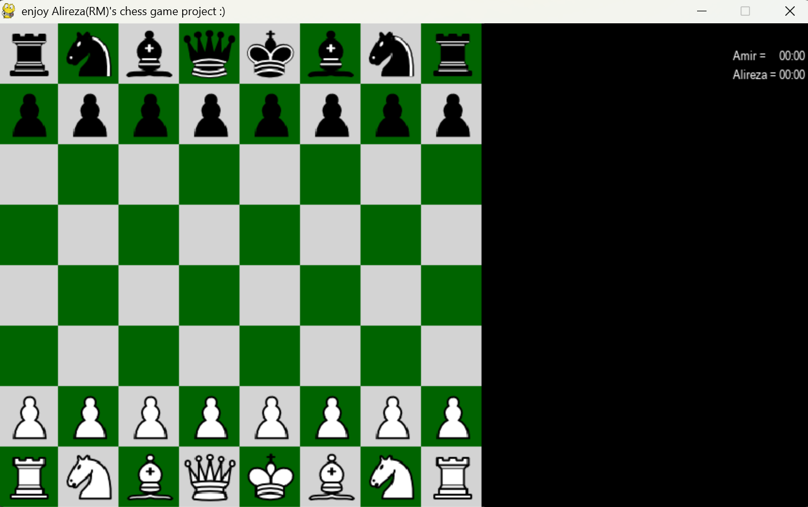
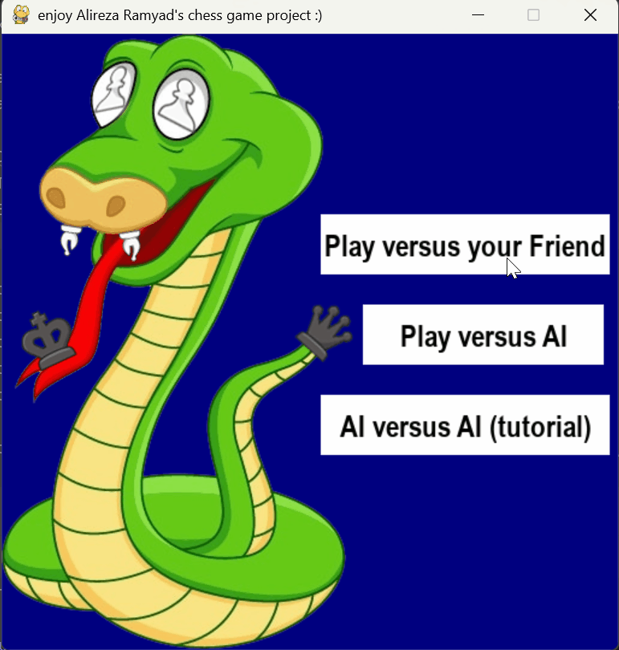

# ♟️ Python Chess AI Game

A fully functional chess game built with Python and Pygame, featuring three game modes and a custom-built AI engine. Developed as a bachelor's degree final project by **Alireza Ramyad**.

---

## 🎮 Game Modes

| Mode | Description |
|------|-------------|
| **Player vs Player** | Two humans play on the same computer |
| **Player vs AI** | You challenge the chess AI engine |
| **AI vs AI** | Watch two AI engines play each other (tutorial/demo mode) |

---

## ⬇️ Download & Run (No Python Required)

You do **not** need Python or any other software installed on your computer.

1. Download **Chess.zip** from the [Releases page](https://github.com/alirezaRMY/Python-Chess-AI-Game/releases/latest)
2. Extract it anywhere on your computer
3. Navigate to: `Chess → Chess → dist → ChessGame`
4. Double-click **ChessGame.exe** to play!

> ✅ No Python interpreter needed. No pip install. Just download and play.

---

## 🧠 About the AI Engine

The AI was built from scratch using only fundamental algorithms — no machine learning, no neural networks, no genetic algorithms. The goal was to prove that a **smart and challenging AI** can be built with simple, well-understood techniques:

- **Negamax** — a clean variant of the Minimax algorithm, where each player tries to maximize their own score
- **Alpha-Beta Pruning** — cuts off branches that can't possibly affect the final decision, making the search significantly faster
- **Piece-Square Tables** — positional scoring tables for each piece type (knights prefer the center, rooks prefer open files, pawns are rewarded for advancing, etc.)
- **Search Depth: 3** — tested and chosen as the best balance between speed and intelligence. The AI thinks fast and plays well

### How strong is it?
Tested with real chess players:
- For **beginners** → it feels **hard**
- For **intermediate players** → it feels like a solid **intermediate** opponent
- It won't beat a grandmaster, but it will punish your mistakes

---

## 🕹️ Controls

| Action | Control |
|--------|---------|
| Select & move a piece | Mouse click |
| Undo last move | `Z` key |
| Reset the game | `R` key |

- Selected pieces are highlighted in **blue**
- Possible moves are highlighted in **yellow**

---

## ⚠️ Known Limitations

- **AI vs AI mode:** The AI is continuously computing moves, so closing the game mid-game may cause the program to crash or freeze for a few seconds before closing. This is expected behavior — wait for the current move to finish computing, then close the window.

---

## ✨ Features

- Clean, animated piece movement
- Full chess rules: castling, en passant, pawn promotion
- Move log panel displayed during the game
- Stopwatch tracking time for each player
- Checkmate and stalemate detection
- Works as a standalone `.exe` — no installation needed

---

## 🚀 Future Improvements

- **Online Multiplayer** — allow two players to play against each other over the network
- **Adjustable AI Difficulty** — let the player choose between Easy, Medium, and Hard before the game starts
- **Opening Book** — preload common chess openings so the AI plays more naturally in the early game
- **Better AI Evaluation** — add king safety, pawn structure analysis, and endgame tables for stronger play
- **Move Timer / Time Control** — add a chess clock with time limits per player (e.g. 5 min blitz)
- **Save & Load Game** — save a game in progress and resume it later
- **Move Hints** — optional hint button that suggests the best move for beginners
- **Sound Effects** — add sounds for moves, captures, and checkmate

---

## 🖼️ Screenshots & Demo

### Main Menu


### Player vs Player


### Game Board


---

### 🎬 Gameplay Demos

### Player vs AI (close-up)


### Player vs Player (close-up)


### Player vs AI — with terminal output
> The terminal shows the AI evaluating and scoring every possible move in real time.


### AI vs AI — with terminal output
> Both AIs continuously calculate move scores. This demo shows the engine thinking out loud after each move.


---

## 🛠️ Run from Source (For Developers)

If you want to run or modify the code:

**Requirements:**
- Python 3.x
- Pygame

```bash
pip install pygame
```

Then run:
```bash
python Chess/Button.py
```

To tweak AI speed vs intelligence, open `Chess/ChessAI.py` and change:

```python
DEPTH = 2  # smoother and faster, but slightly less intelligent
DEPTH = 3  # default — smart and fast enough for smooth gameplay
DEPTH = 4  # smarter but noticeably slower
```

> Higher depth = smarter AI but exponentially longer thinking time.

---

## 📁 Project Structure

```
Chess/
├── images/          # Piece images (PNG)
├── ChessEngine.py   # Game logic, move validation, all chess rules
├── ChessAI.py       # AI engine (Negamax + Alpha-Beta Pruning)
├── ChessMain.py     # Player vs AI game loop
├── ChessMain2.py    # Player vs Player game loop
├── ChessMain3.py    # AI vs AI game loop
├── Button.py        # Entry point / main menu
├── predisplay.py    # Pre-game display screen (Player vs AI)
├── predisplay2.py   # Pre-game display screen (Player vs Player)
└── __init__.py
```

---

## 👨‍💻 Author

**Alireza Ramyad**  
Bachelor's Degree Final Project  
MSc Student in Communication Systems and Networks — Tampere University

---

## 📄 License

This project is licensed under the MIT License — see the [LICENSE](LICENSE) file for details.

---

*If you enjoyed this project, please consider giving it a ⭐ — it means a lot!*
